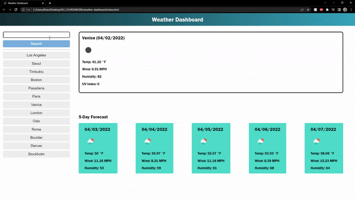

# Weather Dashboard

### This application uses the built-in JS fetch() function to retrieve weather data from the OpenWeather API.

Final application allows user to enter a valid city name into the search bar. Once valid city name is input, the main section renders the current day forecast, and the section below renders the following 5-days' weather. In the sidebar, all previously searched cities (stored in localStorage) appear as quick-search buttons that, when clicked, brings up the weather for that city.

